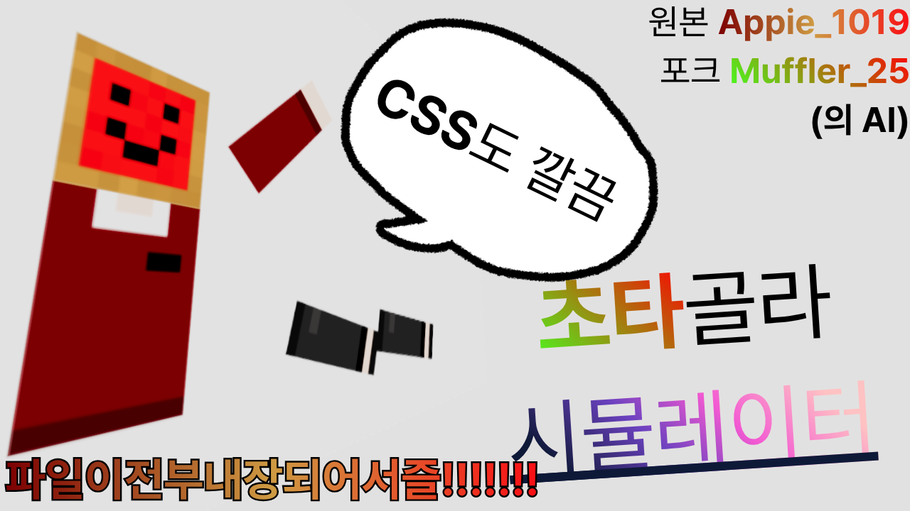

# ChotaGolaSimulator

하등 쓸모없는 무언가를, 하등 쓸모없는 상태 그대로 **더 작게** 만든 포크입니다.

chota는 힌두어로 "작다"라는 뜻이고, 동시에 이 프로젝트가 사용하는 [chota.css](https://jenil.github.io/chota/)의 이름이기도 합니다. 이름부터가 이미 아무짝에도 쓸모없는 의미론적 중의성입니다.

> 개발자 의견 : 원본이 76MB면, 이건 511KB입니다. 뭘 기대하셨나요? 아무짝에도 쓸모없는 건 그대로인데요.

## 링크
* [ChotaGolaSimulator 플레이](https://dfloat.github.io/ChotaGolaSimulator/)
* [원본 GolaGolaSimulator](https://github.com/Appie-1019/GolaGolaSimulator)
* [업데이트 기록](./CHANGELOG.md) — 없습니다. 만들기 귀찮았습니다.

## 이게 뭔가요?
원본 GolaGolaSimulator는 Unity로 만든 "하등 쓸모없는 무언가"였습니다. 이 포크는 그걸 **단일 HTML 파일 하나**로 옮긴 "하등 쓸모없는 무언가"입니다.

* 조작 방식 12종: 기본, 관성, 부드럽게, 회전, 반전, 애피 슬라이드, 발작, 동상, 추적, 나이스한 컴퓨터, 뚱뚱남, 잔상
* 애피 슬라이드는 원본 FBX 모델 데이터를 그대로 사용합니다. 심지어 텍스처까지요.
* 소리도 원본 그대로입니다. GolaGola Voice, Tick, Tock, 그리고 그 유명한 뚱뚱남의 벨소리까지.
* 폰트, 이미지, 소리, 3D 모델 전부 base64로 때려넣었습니다. 와이파이를 꺼도 됩니다. 꺼보세요.

## 조작
* `TAB` : 설정 메뉴. 단, 건너뛸 수 없는 경고 문구가 끝나고 나면 열립니다.
* `M` : 마우스 커서 토글
* 뚱뚱남 모드에서 클릭: 날려보내기. 경계를 넘으면 "너무 빨라서 경계를 넘어섰습니다!" 토스트와 함께 중앙으로 리셋됩니다. 놀랍게도 도움이 전혀 안 됩니다.

## 파일
| 파일 | 설명 |
|---|---|
| `index.html` | 본편 (511KB) |
| `golagolasimulator.html` | 버그 생겼을 때의 안전빵 |

> 개발자 의견 : 버그가 생기면 안전빵으로 돌아가시면 됩니다. 어차피 뭐가 달라도 아무짝에도 쓸모없는 건 똑같습니다.
